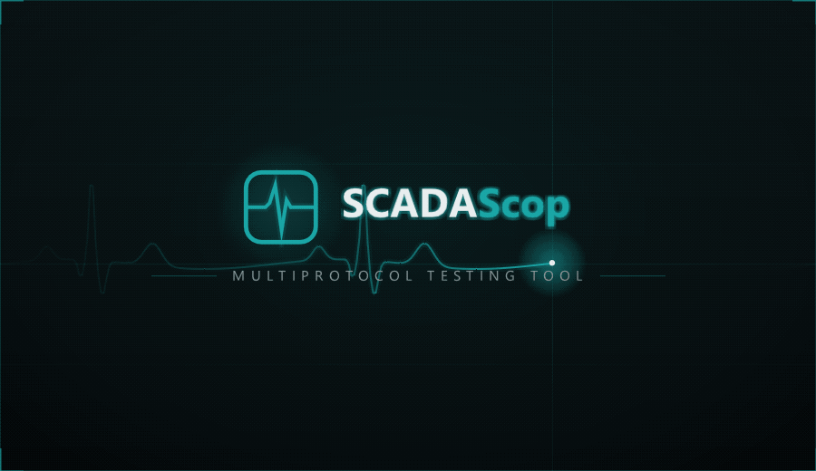

<p align="center">
  
</p>

**SCADAScop** is a free **multiprotocol SCADA testing tool** with a modern,
dockable **Dear ImGui** interface. It brings the whole Scop family into one
application: **Modbus**, **DNP3 (IEEE 1815)**, **IEC 60870-5-104**, and
**IEC 60870-5-101** — each as **Master and Slave** — all running **at the same
time** on one grouped channel tree. Poll real PLCs over Modbus while simulating a
DNP3 outstation and an IEC 104 station for the SCADA under test, in a single
window, with one workspace file.

Every protocol stack is **hand-rolled over Asio**, with no third-party protocol
library, and shared with the standalone ModbusScop, DNPScop, IEC104Scop, and
IEC101Scop tools.

Free to use and redistribute under the permissive **BSD 2-Clause License**.

Developed by **Carlos Nardi**.

[](https://buymeacoffee.com/cnardi)

<p align="center">
  
</p>

## Concept

SCADAScop is organized as a tree: **Groups → Channels → (protocol-native
subtree)**.

- A **Group** is a user-named container — a substation, a bay, a test rig. Use
  one or many; the tree stays flat while there is only one.
- A **Channel** declares a **Role** (Master or Slave) and a **Protocol** (Modbus,
  DNP3, IEC 60870-5-104, IEC 60870-5-101), then the matching Scop tool's own New
  Channel dialog asks for the endpoint: TCP, UDP, or serial, as each protocol
  allows. Each channel runs on its own I/O thread and **keeps running regardless
  of what is on screen**; start and stop them independently. Every channel has
  an **accent color** (a per-protocol default, or your own) that also tints that
  channel's windows.
- Under each channel the tree shows the **protocol-native structure** you know
  from the standalone tools — RTUs and maps for Modbus, outstations and points for
  DNP3, stations and information objects for IEC — with the same context menus
  (Add RTU, Points, Events, Messages, Tools…) and the same working windows.

## Included tools

| Protocol | Master | Slave |
|----------|--------|-------|
| Modbus TCP / UDP / RTU (serial, and RTU over the network), TLS | ModbusScop Master | ModbusScop Slave |
| DNP3 (IEEE 1815) over TCP / UDP / serial, DNP3 over TLS | DNPScop Master | DNPScop Slave |
| IEC 60870-5-104 over TCP, TLS (IEC 62351-3 transport) | IEC104Scop Master | IEC104Scop Slave |
| IEC 60870-5-101 over serial / TCP tunnel, TLS | IEC101Scop Master | IEC101Scop Slave |
| **P2P Monitoring** (any protocol; each leg TCP or serial, TLS per leg) | man-in-the-middle proxy: listen port or COM port → RTU (TCP or COM port) | — |

Each tool is the same code as its standalone release — poll windows, point
databases, message schedules, simulation, glue logic, fault injection, CSV
import/export, and the per-protocol Communication Monitor with layered frame
decode are all there. See the individual tool READMEs for the full protocol
feature lists.

## Features

- **All eight tools at once** — any mix of protocols and roles, hosted in one
  docking space, one menu bar, one status bar. Tools are instantiated on demand
  the first time a channel of that kind is created.
- **Grouped channel tree** — organize channels into named groups, reorder them,
  move channels between groups, and color-code each channel. The tree blinks on
  traffic per channel. Shown either way via a **Free / Docked** toggle at the top
  of the panel: *Free* is a floating, dockable window; *Docked* is a fixed left
  side panel with a draggable splitter and a collapse chevron that shrinks it to a
  narrow rail of accent icons (channels as rounded squares, RTUs as triangles —
  apex up for slaves, apex down for masters — pulsing while running and flashing
  on traffic). Both modes share the same width. In the rail, a group bar folds /
  unfolds its channels, clicking a channel reveals its RTUs, and context menus
  start/stop a channel or enable/disable an RTU.
- **One Status Messages window** — the merged, timestamped stream of every
  tool's events, colored by protocol, with a *Source* column (the built-in web
  interface appears as *Web Server*).
- **One Dashboard** — a collapsible section per protocol tool with its live
  traffic counters and connection state.
- **Per-protocol windows on demand** — each tool's own windows (Live Data Map,
  Communication Monitor, Events, Points, Messages, poll windows…) are one click
  away under **View → *tool name***.
- **One Time & Date** — **Tools → Time & Date…** sets a single clock for every
  protocol: System or a running Manual date/time, Local or UTC frame, GMT offset
  (automatic, DST-aware). Every DNP3 outstation and IEC 60870-5 station in the
  workspace stamps its events from it, so cross-protocol event sequences line up.
- **P2P Monitoring channel** — a man-in-the-middle recorder for sites where
  Wireshark cannot be installed: SCADAScop listens on a TCP port, connects to
  the real RTU / device when a master connects, forwards every byte untouched
  in both directions and shows the traffic in a Communication Monitor decoded
  with the family's own decoders (DNP3, IEC 60870-5-101 over TCP, IEC
  60870-5-104, Modbus/TCP, Modbus RTU over TCP — or raw bytes), with **Capture PCAP** for a
  Wireshark-ready file. Created from **New Channel → P2P Monitoring**, started
  and stopped like any other channel; several masters can share one channel.
  Each leg is TCP **or a serial port**: bridge a serial front-end to a TCP RTU
  (connecting when the port opens or when the first bytes arrive), a TCP
  master to a serial device, or serial to serial.
- **PCAP capture** — every Communication Monitor (all tools, standalone or
  embedded) can write the frames it shows to a `.pcap` file.
- **Security (TLS)** — every TCP channel of every protocol, master or slave,
  can run over TLS 1.2 / 1.3 with certificate authentication both ways; the
  P2P Monitoring channel secures each of its two legs independently. See
  [Security (TLS)](#security-tls) below.
- **One Charts window** — **Tools → Charts** opens the family's chart window
  over every master channel at once: link measurands and indications from
  DNP3, IEC 60870-5 and Modbus masters onto the same time axis (tabs, three
  Y axes, logic-analyzer lanes for binaries, cursors with a value readout,
  Local / Standard / UTC time, events-only mode, CSV export and a continuous
  CSV recorder). Right-click **Add to chart** or drag points from any embedded
  tool's point window; charts are saved in the workspace.
- **One workspace** — **File → Save Workspace** writes a single self-contained
  `.ssw` file (format 2) that records groups, channel bindings, accent colors and
  every channel, point, schedule and simulation together — no per-tool side
  files. SCADAScop **reopens the last workspace on launch** and keeps a
  recent-files list. Channels and RTUs can be exported / imported and copied /
  pasted between channels (and between the standalone tools) as the same
  plain-text blocks.
- **One look** — dark / light / classic themes with a customizable accent color,
  DPI scaling, always-on-top, GPU or CPU rendering; the shell owns the theme so
  every tool matches.
- **Animated splash and About** — the family's animated splash rotates its style
  on each launch.

## Security (TLS)

Every TCP channel — DNP3, IEC 60870-5-104, IEC 60870-5-101 over TCP and
Modbus/TCP (MBAP or RTU framing), as master or as slave — has a
**Security (TLS)** section in its New Channel / Channel Settings dialog. TLS is
applied at the transport, so the protocol above it is untouched: a DNP3 outstation
served over TLS speaks exactly the same DNP3, only inside an authenticated,
encrypted connection (the model of IEEE 1815 "DNP3 over TLS", IEC 62351-3 for IEC
60870-5-104 and Modbus/TCP Security).

**What each side needs**

| Side | Role in TLS | Fields |
|------|-------------|--------|
| Slave / outstation / station channel | TLS **server** | CA certificate that signs the masters' certificates, own certificate + private key (optional key password), *Require client certificate* (mutual authentication), minimum TLS version |
| Master channel | TLS **client** | CA certificate that signs the slave's certificate, own certificate + private key (sent when the server asks), *Peer name* the slave's certificate must carry, minimum TLS version |
| P2P Monitoring channel | server towards the master **and** client towards the RTU | the two sections above, one per leg, independently — a clear-text master can be bridged to a TLS device and vice versa |

Turning TLS on offers to switch the port to the protocol's secure port — **19999**
for DNP3, **19998** for IEC 104, **802** for Modbus/TCP; IEC 101 has no
registered port, so the dialog suggests the current port + 1. Certificates and keys
are PEM files; the settings are saved in the workspace with the channel (the key
password in clear text — keep lab workspaces private).

**Lab walk-through** (both tools on one PC, or any two machines):

1. Get a certificate set. Either press **Generate lab certificates…** in any TLS
   section (pick a folder and the slave's host name / IP), run
   `tools\New-ScopLabCerts.ps1 -ServerName <slave host or IP>` from PowerShell,
   or use the ready-made loopback set in `resources\certs` (valid for
   `localhost` / `127.0.0.1` only). All three produce the same six files:
   `ca.pem`, `ca-key.pem`, `server.pem`, `server-key.pem`, `client.pem`,
   `client-key.pem`.
2. On the **slave** channel: *Security (TLS)* → **Enable TLS**, accept the secure
   port, *CA* = `ca.pem`, *Certificate* = `server.pem`, *Key* = `server-key.pem`,
   leave *Require client certificate* on. Press **Test certificates** — it parses
   the files, checks that the key matches the certificate and that the chain
   verifies — then **Start**.
3. On the **master** channel: **Enable TLS**, same port, *CA* = `ca.pem`,
   *Certificate* = `client.pem`, *Key* = `client-key.pem`, *Peer name* = the name
   or IP you gave the slave (`localhost` for the ready-made set). **Test
   certificates**, then **Start**.
4. Watch the **Status Messages**: both sides log `TLS established with …:
   TLSv1.3, <cipher>, peer CN=…`, the channel label reads `TLS host:port` with the
   negotiated version, and the same line appears as a notice row in each
   Communication Monitor. A failed handshake is logged with OpenSSL's reason
   (`certificate verify failed`, `hostname mismatch`, …) and the channel stays
   down — fix the file or the peer name and start again.

For a real system, drop in the certificates issued by your own PKI: each device
its own certificate and key, the plant CA in the *CA* field. Only the three PEM
files are needed. The tools link OpenSSL statically, so nothing has to be
installed on the test machine.

## Download & run

1. Go to the [**Releases**](../../releases) page and download the latest
   `SCADAScop` archive for Windows.
2. Unzip it anywhere and run **`SCADAScop.exe`** — no installation required.

**Requirements:** Windows 10/11 (64-bit).

**Rendering:** SCADAScop uses the GPU by default; you can switch to **CPU
(software)** rendering under **View → Rendering** (handy over Remote Desktop or in
VMs).

### Getting started

1. **Channel → New Channel...** (Ctrl+N) or **+ Channel** — pick the **Role**
   (Master / Slave) and the **Protocol**, press **Continue**, and fill in that
   tool's endpoint dialog (host and port, bind address, COM port, link addresses,
   framing…).
2. Repeat for every device you want to poll or simulate — a Modbus master
   channel to a PLC, a DNP3 slave channel for the SCADA, an IEC 104 station…
   Optionally **+ Group** to organize them and pick an **Accent color** per
   channel.
3. Expand a channel to work with its RTUs, points, maps, and schedules exactly
   as in the standalone tool; right-click for the tool's own actions.
4. Press **Start** on each channel. Follow everything in the shared **Status
   Messages** and **Dashboard**, and open a protocol's **Communication Monitor**
   from the **View** menu to see its frames decoded.

Use **File → Save Workspace** (Ctrl+S) to keep the whole multiprotocol setup and
reload it later with **Open Workspace** (Ctrl+O) — or just start SCADAScop again;
it reopens the last workspace.

## Third-party libraries

SCADAScop is built with these open-source components, each under its own license:

| Library | Used for | License |
|---------|----------|---------|
| Dear ImGui (docking) | user interface | MIT |
| ImPlot | chart window | MIT |
| GLFW 3 | window / OpenGL context | Zlib/libpng |
| OpenGL 3 | rendering | — |
| Asio (standalone) | TCP / UDP / serial transport for every protocol | Boost Software License 1.0 |
| OpenSSL 3 | TLS for every TCP channel (statically linked) | Apache License 2.0 |
| stb_image | logo / splash decoding | MIT / public domain |

The Modbus, DNP3, IEC 60870-5-104, and IEC 60870-5-101 protocol stacks are
original code, not third-party libraries.

## License

SCADAScop is released under the **BSD 2-Clause License**. It is provided "as is",
without warranty of any kind; the author is not responsible for any damage or
loss caused by its use.

```
BSD 2-Clause License

Copyright (c) 2026, Carlos Nardi
All rights reserved.

Redistribution and use in source and binary forms, with or without
modification, are permitted provided that the following conditions are met:

1. Redistributions of source code must retain the above copyright notice,
   this list of conditions and the following disclaimer.

2. Redistributions in binary form must reproduce the above copyright notice,
   this list of conditions and the following disclaimer in the documentation
   and/or other materials provided with the distribution.

THIS SOFTWARE IS PROVIDED BY THE COPYRIGHT HOLDERS AND CONTRIBUTORS "AS IS"
AND ANY EXPRESS OR IMPLIED WARRANTIES, INCLUDING, BUT NOT LIMITED TO, THE
IMPLIED WARRANTIES OF MERCHANTABILITY AND FITNESS FOR A PARTICULAR PURPOSE
ARE DISCLAIMED. IN NO EVENT SHALL THE COPYRIGHT HOLDER OR CONTRIBUTORS BE
LIABLE FOR ANY DIRECT, INDIRECT, INCIDENTAL, SPECIAL, EXEMPLARY, OR
CONSEQUENTIAL DAMAGES (INCLUDING, BUT NOT LIMITED TO, PROCUREMENT OF
SUBSTITUTE GOODS OR SERVICES; LOSS OF USE, DATA, OR PROFITS; OR BUSINESS
INTERRUPTION) HOWEVER CAUSED AND ON ANY THEORY OF LIABILITY, WHETHER IN
CONTRACT, STRICT LIABILITY, OR TORT (INCLUDING NEGLIGENCE OR OTHERWISE)
ARISING IN ANY WAY OUT OF THE USE OF THIS SOFTWARE, EVEN IF ADVISED OF THE
POSSIBILITY OF SUCH DAMAGE.
```
